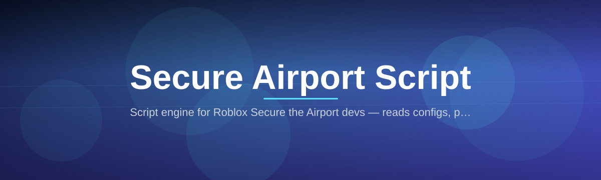
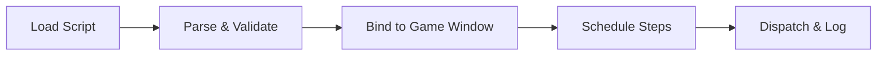

# airport-security-script-engine

*A standalone script engine for players and builders working with the Secure the Airport game loop, built for Windows.*

## What this is

**TL;DR:** airport-security-script-engine is a lightweight Windows application that loads, edits, and runs custom scripts written for the Secure the Airport game — no external editor or engine install required.

Secure the Airport is a checkpoint-and-response simulation where timing, queue management, and scripted event sequences matter more than raw reflexes. This project grew out of wanting a repeatable way to test scripted behaviors — patrol routes, alert triggers, checkpoint scheduling — without rebuilding the same logic by hand every session. The engine reads a simple script format, executes it against the running game window, and gives you a live log of what fired and when.

The second half of the story is architecture, not features: the engine was built as a single standalone executable on purpose. Early prototypes depended on a scripting runtime installed separately, and that made distribution and troubleshooting painful for anyone who just wanted to try a script. Version 2026 packages the interpreter, the UI, and the file watcher into one binary, so the thing you download is the thing you run.

  

The button opens the project's landing page, where the current build is available to download.

## Who it is for

**TL;DR:** built for people who write, test, or run Secure the Airport scripts on a regular basis.

- **Script writers** iterating on checkpoint and patrol logic who want fast reload-and-test cycles.
- **Speed and consistency testers** who need the same scripted sequence to run identically every time.
- **Community moderators** validating community-submitted scripts before sharing them.
- **Content creators** who script repeatable scenarios for recordings or streams.
- **Curious players** who want to understand how the game's scripting hooks actually behave.

## What you can do

**TL;DR:** the engine covers writing, running, watching, and debugging Secure the Airport scripts in one window.

- **Load and run** `.sas` script files directly against a live game session.
- **Edit inline** with a built-in text pane, so you don't need to alt-tab to a separate editor.
- **Watch execution in real time** through a step-by-step log of triggered events and timings.
- **Set breakpoints** on specific script lines to pause execution and inspect state.
- **Save named profiles** for different checkpoint layouts or scenario setups.
- **Re-run instantly** with a single hotkey once a script is loaded.
- **Export run logs** as plain text for comparing behavior across script revisions.
- **Detect the game window automatically** on startup, with a manual override if detection fails.

## Getting started

**TL;DR:** download from the landing page, run the executable, point it at the game, load a script.

1. Open the landing page using the download button above.
2. Download the current Windows build (no installer required).
3. Run the executable — Windows may show a first-run SmartScreen notice for new binaries; choose "Run anyway" if you trust the source.
4. Launch Secure the Airport, then let the engine auto-detect the game window (or set it manually in Settings).
5. Load a `.sas` script from the file menu and press Run.

## Requirements

**TL;DR:** Windows 10 or 11, nothing else installed.

- Windows 10 or Windows 11 (64-bit)
- No .NET, Python, or Node runtime needed — the engine is fully self-contained
- No build toolchain, no package manager, no compiler
- A working install of Secure the Airport to target

## How it works

**TL;DR:** the engine parses your script, matches it to live game state, and dispatches timed actions back into the game window.

1. **Parse** — the `.sas` file is read and validated line by line.
2. **Bind** — the engine locates the Secure the Airport window and confirms it's responsive.
3. **Schedule** — each script step is queued with its intended timing offset.
4. **Dispatch** — actions are sent to the game in sequence, with the log updating as each one fires.
5. **Report** — a run summary is written out, showing what executed, skipped, or errored.

## FAQ

**TL;DR:** answers to the questions most people actually search before trying a Secure the Airport script tool.

**Is this an official Secure the Airport tool?**
No. This is an independent script engine built to run community and personal scripts against the game; it isn't affiliated with the game's original developers.

**Do I need to know how to code to use it?**
Basic scripts are readable plain text with simple commands, but writing new ones from scratch is easier if you're comfortable with step-by-step logic.

**Will this work if the game updates?**
Window detection and dispatch are built to be resilient to minor UI changes, but major game updates can require an engine update to match.

**Can I share scripts I write with others?**
Yes — `.sas` files are plain text and portable; you can share them however you like.

**Why is it Windows-only?**
The dispatch layer talks directly to the Windows window manager, which keeps input timing accurate but ties the current build to Windows.

## Troubleshooting

**TL;DR:** most issues trace back to window detection, script syntax, or Windows blocking a new executable.

- **The engine doesn't detect the game window** — confirm Secure the Airport is running and not minimized, then set the window manually in Settings.
- **A script fails to load** — check the log pane for the exact line number; most failures are a missing closing bracket or a misnamed action.
- **Windows blocks the executable on first run** — this is standard SmartScreen behavior for new binaries; verify the source, then allow it to run.
- **Actions fire late or out of order** — close background apps competing for CPU during the run; timing precision depends on system load.

## License

Released under the [MIT License](LICENSE). This project is provided as-is, with no warranty; use it at your own discretion and in line with the terms of the game you're scripting for.

  

